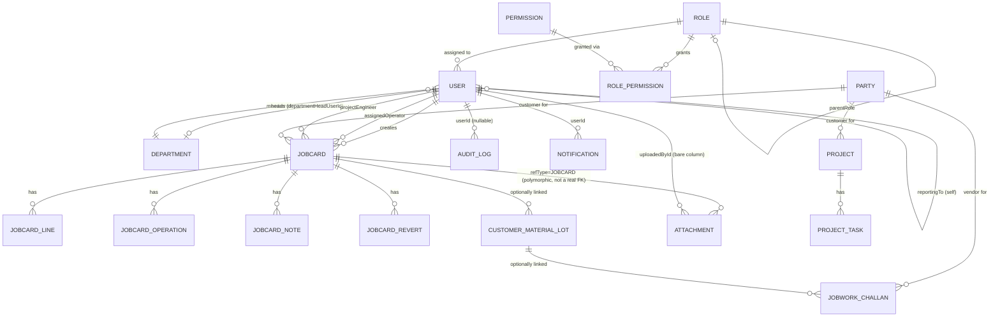
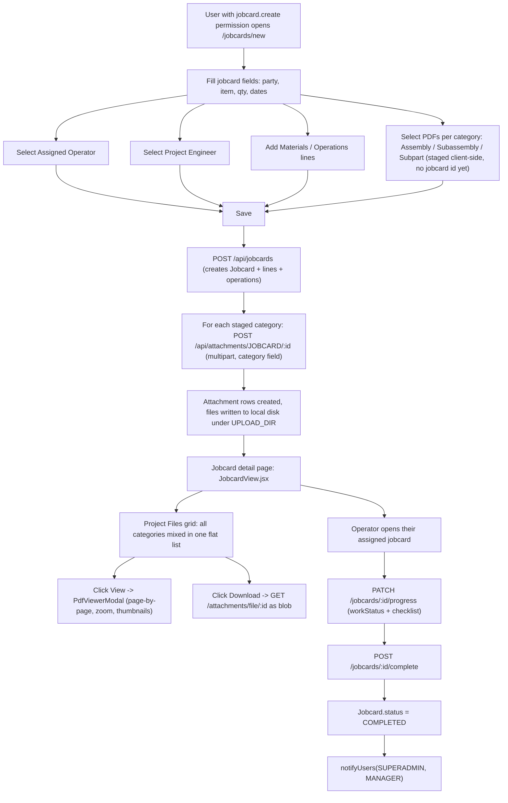

# Project Current Flow Analysis

> This document is a factual, evidence-based snapshot of the **current** codebase at `c:\Users\ACER\Downloads\uvtech\utech erp`. No application code, schema, API, or UI was changed to produce this document — it is read-only analysis. Every claim below cites the exact file(s) it was verified against. Where something does not exist in the code, this is stated explicitly as **Not found in the current codebase** rather than assumed.

---

## 1. Project Overview

- **Project name**: U-Tech Automation Industries ERP (`utech-erp-backend` / `utech-erp-frontend` per `package.json` names). Referenced in the UI as "UTech ERP — Smart Manufacturing".
- **Frontend technology**: React 18 + Vite 5, React Router v6, Tailwind CSS, Zustand (auth store), Axios (API client), `react-hot-toast` (toasts), `lucide-react` (icons), `recharts` (charts), `pdfjs-dist` (in-browser PDF rendering). Source: `frontend/package.json`.
- **Backend technology**: Node.js + Express 4. Source: `backend/package.json`, `backend/src/server.js`.
- **Database technology**: MySQL. Source: `backend/prisma/schema.prisma` (`datasource db { provider = "mysql" ... }`).
- **ORM / DB query system**: Prisma (`@prisma/client` v5, `prisma` CLI for migrations). Migrations are **hand-written SQL files** under `backend/prisma/migrations/*/migration.sql` (not auto-generated by `prisma migrate dev` in the recent history), following a consistent `-- AlterTable` / `-- CreateTable` / `-- CreateIndex` / `-- AddForeignKey` style.
- **Authentication method**: JWT (`jsonwebtoken`), issued on login (`backend/src/controllers/auth.controller.js`), verified per-request in `backend/src/middleware/auth.js` (`requireAuth`). Passwords hashed with `bcryptjs`. There is also an OTP login/reset scaffold (`Otp` model, `backend/src/controllers/auth.controller.js`) but it currently only logs OTP codes to the console — no real email/SMS delivery is wired (see Section 17).
- **Authorization and role management method**: A fully **dynamic, database-driven Role/Permission system** — not hardcoded role enums. `Role` (name, code, hierarchyLevel, requiresDepartment, scopeToDepartment, isActive, isSystem), `Permission` (dot-namespaced keys like `jobcard.create`), and a `RolePermission` many-to-many join table. `middleware/auth.js`'s `requirePermission(...)` checks the caller's role's granted permission keys, with a SUPERADMIN bypass. Two role **names** are still checked as literal strings in a few places (`'SUPERADMIN'`, `'OPERATOR'`) — see Section 7/9 for exactly where.
- **File storage method**: **Local disk only.** Files are written under `path.resolve(env.UPLOAD_DIR)` (default `./uploads`) via `multer.diskStorage`, with randomized `uuid()`-based stored filenames. No cloud storage SDK (S3/GCS/Azure Blob) is used anywhere in the codebase. Source: `backend/src/controllers/attachment.controller.js`, `backend/src/config/env.js`.
- **Main application modules** (from the API mount list and nav structure — see Sections 15–16): Auth, Users, Roles, Departments, Parties (Customers/Vendors), Items, Machines, Processes, Quotations, Invoices, Jobcards ("Projects" in the shop-floor sense), Jobwork (vendor material dispatch), Dispatch, Purchase Orders, GRN, Purchase/Sales Returns, Back Orders, Production (batches/shifts), BOM, Quality, a separate simpler "Projects" module (tasks/budget), Customer Material tracking, Stock/Inventory, Expenses, Reports, Tally export, Notifications, Dashboard/Analytics.
- **Important third-party packages**:
  - Backend (`backend/package.json`): `@prisma/client`, `express`, `jsonwebtoken`, `bcryptjs`, `zod` (request validation), `multer` (file upload), `pdfkit` (PDF *generation*, e.g. invoice PDFs), `xlsx` (report exports), `dayjs`, `helmet`, `cors`, `express-rate-limit`, `morgan`, `uuid`. **`nodemailer` is a declared dependency but is not actually imported/used anywhere in `backend/src`** (see Section 17).
  - Frontend (`frontend/package.json`): `react-router-dom`, `zustand`, `axios`, `pdfjs-dist`, `recharts`, `react-hot-toast`, `lucide-react`, `tailwindcss`.

---

## 2. Technology Stack

| Layer | Technology | Version (from package.json) |
|---|---|---|
| Frontend framework | React | ^18.3.1 |
| Frontend build tool | Vite | ^5.4.11 |
| Frontend routing | react-router-dom | ^6.28.0 |
| Frontend state | zustand | ^5.0.1 |
| Frontend styling | Tailwind CSS | ^3.4.15 |
| Frontend HTTP client | axios | ^1.7.7 |
| PDF rendering (client) | pdfjs-dist | ^4.10.38 |
| Backend runtime | Node.js | >=18 (engines) |
| Backend framework | Express | ^4.21.1 |
| ORM | Prisma (`@prisma/client` + `prisma` CLI) | ^5.22.0 |
| Database | MySQL | (via `mysql://` connection string in `.env`) |
| Auth | jsonwebtoken + bcryptjs | ^9.0.2 / ^2.4.3 |
| Validation | zod | ^3.23.8 |
| File upload | multer | ^1.4.5-lts.1 |
| PDF generation (server, e.g. invoices) | pdfkit | ^0.15.1 |
| Excel export | xlsx | ^0.18.5 |
| Process manager (deployment) | PM2 (via `deploy.py` / `ecosystem.config.js`) | Not found in package.json (external tool) |
| Deployment | Custom Python script (`deploy.py`) over SSH/SFTP to a CloudPanel-managed VPS | N/A |

---

## 3. Folder Structure

```text
utech erp/
  deploy.py                     # Python SSH/SFTP deploy script (not part of the app runtime)
  deploy_config.json            # gitignored — deploy credentials
  credential.md                 # gitignored — deploy credential documentation
  ERP_FLOW_AND_LOGIC.md          # pre-existing business-logic documentation (not generated by this task)

  backend/
    prisma/
      schema.prisma              # single source of truth for the DB schema
      seed.js                    # dev-DB seed script (roles, permissions, departments, demo data)
      migrations/
        <timestamp>_<name>/migration.sql   # one hand-written SQL file per migration
    src/
      server.js                  # Express app entry point; mounts every route module
      config/
        env.js                   # reads/validates process.env
        prisma.js                # shared PrismaClient instance
      middleware/
        auth.js                  # requireAuth / requirePermission
        validate.js               # zod schema-validation middleware
        errorHandler.js, notFound.js
      routes/                    # one *.routes.js per module (thin — wires path + permission + controller)
      controllers/                # one *.controller.js per module (business logic)
      validators/                 # zod schemas, one *.schema.js per module
      services/
        stockService.js           # single mutation path for company vs customer stock
      utils/
        audit.js                  # AuditLog writer
        notify.js                 # Notification writer
        numbering.js               # document-number/code generators
        pagination.js               # list-query parsing helper
        jobcardProgress.js          # jobcard checklist defaults/validation
        gst.js, httpError.js, asyncHandler.js

  frontend/
    src/
      main.jsx, App.jsx           # route table lives in App.jsx
      store/
        auth.js                   # zustand auth store
      lib/
        api.js                    # axios instance
        format.js                 # currency/date formatting helpers
      components/
        layout/AppLayout.jsx        # sidebar nav + topbar (role-aware)
        layout/NotificationBell.jsx
        pdf/PdfViewerModal.jsx       # full PDF page-by-page viewer
        jobcards/                   # jobcard-specific widgets (checklist, etc.)
        gallery/, ui/                # shared UI primitives (DataTable, Pagination, Badge, PageHeader...)
      pages/
        auth/Login.jsx
        Dashboard.jsx, operator/OperatorDashboard.jsx
        users/, roles/, departments/         # RBAC admin pages
        parties/, items/, machines/, process/ # masters
        quotations/, invoices/                # sales
        jobcards/                             # the shop-floor "project" module (list/form/view)
        jobwork/, dispatch/                   # vendor material dispatch / customer dispatch
        purchase/, purchaseReturns/, salesReturns/, backOrders/  # procurement/returns
        production/, bom/, quality/            # manufacturing
        customerMaterial/, stock/              # two-bucket inventory system
        project/                               # the SEPARATE simpler admin "Projects" module (tasks/budget)
        expense/, reports/, analytics/         # finance/reporting

(node_modules, dist/build output, .git, and cache/log directories omitted throughout)
```

**Important naming note found during analysis**: there are **two distinct "project" concepts** in this codebase that must not be confused:
1. **`Jobcard`** (DB table `Jobcard`, frontend folder `frontend/src/pages/jobcards/`, API `/api/jobcards`) — the shop-floor manufacturing project: has an assigned operator, project engineer, checklist, work status, PDF attachments, BOM lines, operations. The sidebar labels this "Projects" under the **Masters** section (`AppLayout.jsx` nav item `Projects → /jobcards`).
2. **`Project`** / **`ProjectTask`** (DB tables `Project`/`ProjectTask`, frontend folder `frontend/src/pages/project/`, API `/api/projects`) — a separate, much simpler project-with-budget-and-tasks module, listed under the **Admin** nav section (`Projects → /projects`). It has no PDF/document attachments, no operator/engineer assignment, and no checklist.

Sections 4–10 of this document (project creation, PDF upload/display, Project Engineer/Department Head/Operator workflows) are about the **`Jobcard`** model, since that is the one with PDF uploads, operator assignment, and the workflow the requested future features (Assembly/Subassembly/Subparts, assignment chains) would extend.

---

## 4. Project Creation Flow

Tracing `Jobcard` creation end-to-end:

1. **Frontend page**: `frontend/src/pages/jobcards/JobcardForm.jsx`, rendered at route `jobcards/new` (no `:id` param) — see `frontend/src/App.jsx`.
2. **Form fields available** (from the `form` state and JSX in `JobcardForm.jsx`): date, Party (customer), Item, Item Description, Qty Ordered, **Assigned Operator** (dropdown of all users, showing role name), **Project Engineer** (dropdown filtered to users whose role is exactly `"Project Engineer"`), Project Number, Assembly Number, Drawing Number, Start Date, End Date, Remarks, a repeatable **Materials/lines** table (item, qty, uom, notes — each line can have its own PDF attachments), and a repeatable **Operations** table (process, machine, sequence). Plus three PDF-upload sections keyed by category: **Assembly**, **Subassembly**, **Subpart** (see Section 5).
3. **Form validation**: Minimal — mostly HTML `required` attributes on native inputs (e.g. the `date` field) and a `qtyOrdered` number input. There is no visible client-side schema validation library in use on this form; real validation happens server-side via the zod schema in `backend/src/validators/jobcard.schema.js` (`createJobcardSchema`), enforced by the `validate` middleware in `backend/src/routes/jobcard.routes.js`.
4. **Multiple PDF selection**: Each of the three category sections renders its own `<input type="file" accept="application/pdf" multiple>`; selecting files calls `uploadCategoryPdfs(e, categoryKey)` in `JobcardForm.jsx`.
5. **How files are uploaded**:
   - If the jobcard **doesn't exist yet** (pure "new" flow), selected files are staged client-side into a `pendingDocs` state (`{ ASSEMBLY: [], SUBASSEMBLY: [], SUBPART: [] }`) — nothing is sent to the server yet, since there's no `jobcardId` to attach them to.
   - On **Save**, the jobcard is created first (`POST /jobcards`), then the code loops over `pendingDocs` and uploads each category's staged files via `uploadFilesTo(jobcardId, null, files, category)`, which does `POST /attachments/JOBCARD/:jobcardId` with a `multipart/form-data` body (`files` repeated field + `category` field). Source: `JobcardForm.jsx` `save()`, lines ~186–232.
   - If editing an **existing** jobcard, each file input's `onChange` uploads immediately (no need to press Save first).
6. **Which API is called**:
   - Create the jobcard: `POST /api/jobcards` (validated by `createJobcardSchema`).
   - Upload PDFs: `POST /api/attachments/JOBCARD/:jobcardId` (multer `upload.array('files', 20)` + `category`/`lineId` form fields).
7. **Backend route**: `backend/src/routes/jobcard.routes.js` → `POST /` → `jobcard.controller.js`'s `create`. Attachment route: `backend/src/routes/attachment.routes.js` → `POST /:refType/:refId` → `attachment.controller.js`'s `uploadFiles`.
8. **Controller/service processing**: `jobcard.controller.js`'s `create()` generates a sequential `number` (via `nextNumber('jobcard', 'jobcard')`), creates the `Jobcard` row plus its `lines`/`operations` in one `prisma.jobcard.create({ data: { ..., lines: { create: lines }, operations: { create: operations } } })` call, sets `createdById` from `req.user`, and writes an `AuditLog` row via `audit(req, 'create', 'Jobcard', jc.id, { number })`.
9. **How project data is stored**: In the `Jobcard` table (see Section 14 for full field list), with related rows in `JobcardLine` and `JobcardOperation`.
10. **How PDF information is stored**: As rows in the generic `Attachment` table, **not** a dedicated "project document" table — see Section 5.
11. **Storage location**: Local disk under `UPLOAD_DIR` (see Section 1) — never cloud storage.
12. **Response returned to frontend**: The created `Jobcard` (with its `INCLUDE` relations — party, lines, operations, createdBy, assignedOperator, projectEngineer) as JSON, HTTP 201. Attachment uploads respond 201 with the array of created `Attachment` rows.

---

## 5. Current Multiple PDF Upload Structure

- **Storage shape**: PDFs are stored as **separate database records** in one shared `Attachment` table (not an array/JSON blob inside the `Jobcard` row, not one row per project). The link back to the jobcard is a **polymorphic `refType`/`refId` pattern** (`refType = "JOBCARD"`, `refId = Jobcard.id`), not a formal Prisma `@relation` — there is no `Jobcard.attachments Attachment[]` relation field declared in the schema; the association is resolved manually in application code by filtering `Attachment` on `refType`/`refId`.
- **Fields stored per PDF** (`Attachment` model, `backend/prisma/schema.prisma`): `id`, `refType` (String), `refId` (Int), `lineId` (Int?, optional link to a specific `JobcardLine`), `category` (String?, nullable, free text — see below), `filename` (original name), `storedName` (randomized UUID + extension, the actual on-disk name), `mimeType`, `size` (bytes), `uploadedById` (Int?, **not** a formal `User` relation — just a bare column), `createdAt`.
- **Filename / URL / size / upload date / uploader / document type — which are actually stored?**
  - Filename: yes (`filename`, original name preserved for display).
  - File URL: no persistent URL column — files are served dynamically via `GET /attachments/file/:id`, which streams from disk using `storedName`.
  - Size: yes (`size`, bytes).
  - Upload date: yes (`createdAt`).
  - Uploader: the **id** is stored (`uploadedById`), but it is a bare `Int?` column with no `@relation` to `User` in the schema, and the frontend's PDF gallery (`JobcardView.jsx`) never fetches/displays the uploader's name.
  - Document "type"/category: yes, via the `category` field — but see next point, it is **not a real enum**.
- **Is `category` an enum, JSON, or something more structured?** It is a **plain nullable `String` column** (`category String?`). The schema comment documents `"ASSEMBLY" | "SUBASSEMBLY" | "SUBPART"` as example values, but there is no Prisma `enum` enforcing this — the database will accept any string. In practice the codebase uses **four** ad-hoc string values for this one column: `"ASSEMBLY"`, `"SUBASSEMBLY"`, `"SUBPART"` (from `frontend/src/pages/jobcards/JobcardForm.jsx`'s hard-coded `DOC_CATEGORIES` array, duplicated again in `JobcardView.jsx`), plus `"GENERAL"` (used by a separate generic "Attach Files" upload widget in `JobcardView.jsx` for non-image, non-categorized files). The backend (`attachment.controller.js`) never validates or branches on the value of `category` — it's stored and returned as-is.
- **PDF order**: Not explicitly maintained — attachments are returned `orderBy: { createdAt: 'desc' }` (newest first) by `attachment.controller.js`'s `listFor()`. There is no manual/drag-drop ordering field.
- **Can PDFs be added after project creation?** Yes — in edit mode (`jobcards/:id/edit`), each category's file input uploads immediately on selection (`POST /attachments/JOBCARD/:jobcardId`), no re-save needed.
- **Can PDFs be deleted or replaced?** Deleted: yes, via `DELETE /attachments/file/:id` (`JobcardForm.jsx`'s `deletePdf()` / `JobcardView.jsx`'s equivalent), which removes both the DB row and the on-disk file. Replaced: no explicit "replace" action — a user would delete then re-upload.
- **Are duplicate PDFs allowed?** Yes — there is no filename/hash uniqueness check anywhere in `attachment.controller.js`; the only cap is `MAX_PER_RECORD = 100` attachments per `(refType, refId)` pair.
- **Is PDF metadata available?** Only what's in the `Attachment` row itself (filename, size, mimeType, category, createdAt) — no extracted PDF metadata (page count, author, title from the PDF's own metadata) is stored anywhere; page count is computed client-side at view time by `pdfjs-dist` and never persisted.

**Actual current data shape** (fields that really exist, unlike the illustrative example in the request prompt):

```json
{
  "id": 42,
  "refType": "JOBCARD",
  "refId": 17,
  "lineId": null,
  "category": "ASSEMBLY",
  "filename": "drawing-rev-2.pdf",
  "storedName": "8f1e2c3a-....pdf",
  "mimeType": "application/pdf",
  "size": 245678,
  "uploadedById": 4,
  "createdAt": "2026-08-01T10:15:00.000Z"
}
```
There is no `projectId` field on this record and no nested `documents` array anywhere — every attachment is its own flat row, associated to a jobcard only via `refType`/`refId` matching.

---

## 6. Current PDF Display Flow

- **Which roles can view project PDFs?** Any authenticated user with `jobcard.read` permission can call `GET /attachments/JOBCARD/:jobcardId` (the attachment routes only require `requireAuth`, no `requirePermission` — see Section 15) — but `assertJobcardOwnership()` inside the controller further restricts an `OPERATOR`-role user to only jobcards where `assignedOperatorId` equals their own user id. Every other role (including the newly-added Project Engineer, Department Head, etc.) is unrestricted at the attachment-controller level as long as they can load the jobcard itself.
- **Which frontend page displays the PDFs?** `frontend/src/pages/jobcards/JobcardView.jsx` (route `jobcards/:id`) — the "Project Files" section — and `JobcardForm.jsx` itself (while creating/editing) shows the same category upload/preview UI.
- **Are all PDFs shown in one section?** Yes — `JobcardView.jsx` filters attachments where `category` is one of the three doc-category keys and renders them as **one flat grid** (`grid grid-cols-2 md:grid-cols-4`). The category value itself is **not displayed** on each card, and Assembly/Subassembly/Subpart are **not visually grouped into separate sections** in the current UI, even though the underlying `category` field could support that.
- **Grouped/categorized?** Not in the current UI (see above) — grouping exists only as an upload-time input mechanism (three separate file-input widgets), not as a display-time grouping.
- **Search / filter / sort / pagination / preview?** None found. The file grid is a plain `.map()` with no search box, filter control, sort selector, or pagination. "Preview" exists in the form of a first-page thumbnail per card (`PdfThumbnail` component) plus a full viewer on click.
- **How do PDFs open?** Clicking "View" opens `PdfViewerModal` (`frontend/src/components/pdf/PdfViewerModal.jsx`) — a full-screen, in-app, canvas-rendered, page-by-page viewer (not a new browser tab, not a plain `<iframe>`/embed). It supports page navigation (arrows, keyboard, swipe), a thumbnail sidebar, zoom (0.4x–3x or fit-width), and fullscreen toggle.
- **Are individual PDF pages selectable/referenceable?** No — clicking a page or thumbnail only navigates the viewer to that page; there is no selection state, no "assign this page" action, and no API call keyed to a specific page number anywhere in the code.
- **Are page numbers extracted or stored?** Page count (`numPages`) is computed **client-side only** at view time from the loaded PDF via `pdfjs-dist`; nothing about page count or page numbers is ever written to the database.
- **Can users download PDFs?** Yes — a separate "Download" button (`downloadFile()` in `JobcardView.jsx` / `downloadPdf()` in `JobcardForm.jsx`) fetches the same `GET /attachments/file/:id` endpoint as a blob and triggers a real file download via a hidden `<a download>` link. The backend has no separate "view" vs "download" endpoint — both behaviors hit the same `downloadOne` controller function; the distinction is purely how the frontend consumes the response.

---

## 7. User Roles and Permissions

Roles are **not hardcoded** — they live in the `Role` table and are fully manageable via the Roles admin page (`frontend/src/pages/roles/RolesPage.jsx`, API `/api/roles`). As of the current seed/migrations, these roles exist:

| Role name | Purpose | hierarchyLevel | requiresDepartment | scopeToDepartment |
|---|---|---|---|---|
| `SUPERADMIN` | Full system access, bypasses all permission checks | 0 | false | false |
| `Admin` | Organization administrator | 1 | false | false |
| `Plant Head` | Oversees the entire plant across all departments | 2 | false | false |
| `Project Engineer` | Manages projects across departments | 3 | false | false |
| `Department Head` | Heads a single department | 4 | true | true |
| `Supervisor` | Supervises operators within a department | 5 | true | true |
| `Team Leader` | Leads a team within a department | 5 | true | true |
| `OPERATOR` | Shop-floor operator | 6 | true | false |
| `MANAGER` | Legacy/pre-existing operations-manager role, not part of the newer hierarchy | (null) | false | false |

For **every** role, the actual permissions it holds are whatever `Permission` keys are attached via `RolePermission` — fully data-driven, viewable/editable per-role in the Roles admin UI. There is no fixed, hardcoded permission set per role name in application logic (except the two literal-string checks below).

**Two places still key off a literal role *name* string** (everything else is permission-key-based):
1. `middleware/auth.js`'s `requirePermission()` — `if (req.user.role === 'SUPERADMIN') return next();` (full bypass).
2. `jobcard.controller.js`'s `assertOwnership()` and `attachment.controller.js`'s `assertJobcardOwnership()` — `if (req.user.role === 'OPERATOR' && jc.assignedOperatorId !== req.user.id) throw 403`.

**Role-by-role capability summary** (based on what's actually enforced in code, not aspirational):

- **Super Admin**: Full access to every module (permission bypass). Can view/upload/manage all PDFs, all projects, all users/roles/departments.
- **Admin**: Broad grants across nearly every module (party/item/invoice/quotation/jobcard/jobwork/dispatch/machine/process/purchase/grn/quality/project/expense/attachment/report/customerMaterial/stock/user/department) — effectively everything except being immune to permission checks the way SUPERADMIN is. Can manage users/departments (not Super Admin's account by convention, though not code-enforced).
- **Plant Head**: Granted `read` on every permission module (view-only across the board) — `scopeToDepartment = false`, so **can view all departments' data**, matching the "Plant Head can view all departments" intent.
- **Project Engineer**: Granted jobcard/quotation/project full CRUD plus read-only invoice/user. Can now be assigned to a `Jobcard` via the new `projectEngineerId` field (see Section 8) — but this assignment is purely informational; it does not itself grant or restrict any extra permission.
- **Department Head / Supervisor / Team Leader**: Granted `user.read`/`user.update` (scoped to their own department via `scopeToDepartment`), `jobcard.read`/`jobcard.update`, and `department.read`. Their visibility of the **Users** list (and, per Section 8, the **Departments** list) is enforced to their own department only — but their visibility of **Jobcards/PDFs is not department-scoped** (no `departmentId` exists on `Jobcard` at all — see Section 20).
- **Operator**: Granted `jobcard.read`/`jobcard.update`, `item.read`, `quality.create`/`quality.read`. Additionally hard-restricted by `assertOwnership`/`assertJobcardOwnership` to only their own assigned jobcards (`assignedOperatorId === self`) — this is the one role with true row-level data scoping baked into controller logic, not just the permission table.
- **Vendor**: **Not found in the current codebase** as a *user role*. `Party.type` has a `VENDOR` enum value, but that is a business-partner classification (for procurement/jobwork), not a login-capable application role — there is no `Role` named "Vendor" and no user-facing vendor portal.
- **External Developer**: **Not found in the current codebase.** No role, no model, no workflow.

---

## 8. Project Engineer Workflow

- **How a Project Engineer receives/accesses a project**: There is no dedicated "inbox"/assignment-notification flow. A Project Engineer is simply set as `Jobcard.projectEngineerId` by whoever creates/edits the jobcard (via the "Project Engineer" dropdown in `JobcardForm.jsx`, filtered to users whose `role.name === 'Project Engineer'`). The Project Engineer then finds their projects the same way any non-operator user does — by browsing the full Jobcards list (`/jobcards`) — there is **no filtered "My Projects" view for Project Engineers** the way there is for Operators (`OperatorDashboard.jsx`).
- **Which project details are visible**: The same full `JobcardView.jsx` detail page every other non-operator role sees (party, item, qty, dates, checklist/progress, PDF gallery, notes, activity, revert history) — no reduced or role-specific view.
- **How PDFs are displayed**: Same flat "Project Files" grid described in Section 6 — no Project-Engineer-specific PDF view.
- **Can the Project Engineer assign work?** **Not found in the current codebase.** There is no UI or API for a Project Engineer to assign a jobcard (or a document, or a page) onward to a Department Head or Operator — the only "assignment" fields on `Jobcard` (`assignedOperatorId`, `projectEngineerId`) are both set directly by whoever has `jobcard.update` permission via the same edit form, not via a dedicated Project-Engineer-initiated assignment action.
- **Can the Project Engineer assign a complete PDF or selected PDF pages?** **Not found in the current codebase** — as established in Sections 5–6, there is no document- or page-level assignment mechanism anywhere.
- **Which users can receive assignments?** N/A — no assignment-issuing flow exists to describe recipients for.
- **Is assignment status available?** N/A.
- **Can comments/instructions be added?** `Jobcard.notes` (via `JobcardNote`, kinds `WORK_UPDATE`/`COMMENT`) is a general comment thread on the whole jobcard, usable by any role with `jobcard.read`, not something exclusive to or structured around Project-Engineer-issued instructions.

---

## 9. Department Head Workflow

- **How Department Heads access projects**: Same as Project Engineers — no dedicated queue; they browse `/jobcards` like any other non-operator role. `Jobcard` has no `departmentId` field, so a Department Head's jobcard visibility is **not** scoped to their department (unlike their Users/Departments visibility, which is scoped).
- **How departments are connected to users**: `User.departmentId` (FK → `Department`) and, separately, `Department.departmentHeadUserId` (FK → `User`) — i.e., a department points to its one head, and independently every user (including the head) can carry a `departmentId`. Source: `backend/prisma/schema.prisma`.
- **Do Department Heads receive assignments?** No formal "assignment received" concept exists (see Section 11) — only the generic `assignedOperatorId`/`projectEngineerId` fields on `Jobcard`, neither of which is a Department Head assignment target field.
- **Can they assign work to Operators?** Not via any dedicated "assign" action — they could edit a jobcard's `assignedOperatorId` if they hold `jobcard.update` (which they do, per Section 7's grants), but this is the same generic edit form everyone uses, not a Department-Head-specific hand-off flow.
- **Can they review or approve work?** **Not found.** There is no "review"/"approve" status or action tied to Department Head role anywhere in `jobcard.controller.js` or the `JobcardStatus` enum (which has `DRAFT/IN_PROGRESS/ON_HOLD/REVERTED/COMPLETED/CANCELLED` — no `PENDING_REVIEW`/`APPROVED` states).
- **Can they return work for correction?** The closest existing mechanism is `POST /jobcards/:id/revert` (`JobcardRevert` model: `reason`, `revertedAt`, `revertedById` — a bare, non-relational column) — any role with `jobcard.update` can call it; it is not Department-Head-specific and is not a structured "send back for correction" workflow tied to an assignment.
- **Is workload/assignment status visible?** Not as a dedicated dashboard — a Department Head could infer workload by filtering the Jobcards list, but there's no purpose-built "my department's workload" view.

---

## 10. Operator Workflow

- **How Operators receive work**: `assignedOperatorId` is set on the `Jobcard` (by whoever edits it). The Operator then sees it surface automatically on login.
- **Where assigned work appears**: `frontend/src/pages/operator/OperatorDashboard.jsx`, which the router shows in place of the normal `Dashboard` whenever `user.role === 'OPERATOR'` (`HomeRoute` in `App.jsx`). The backend also self-scopes: `jobcard.controller.js`'s `list()` forces `where.assignedOperatorId = req.user.id` whenever the caller's role is `OPERATOR` — this is a genuine, enforced query-level restriction, not just a hidden UI filter.
- **Can Operators open PDFs?** Yes, the same `JobcardView.jsx` "Project Files" gallery and `PdfViewerModal`, subject to `assertJobcardOwnership` (they can only ever reach jobcards assigned to them; the API itself blocks others with 403, it's not merely hidden in the UI).
- **Can they view selected PDF pages specifically?** No more than any other role — see Section 6, there is no page-level selection concept for anyone.
- **Can Operators update status?** Yes — `PATCH /jobcards/:id/progress` (`updateProgress` controller function) lets them set `workStatus` (`NOT_STARTED/IN_PROGRESS/TESTING/COMPLETED`) and toggle **checklist** items. The checklist is a fixed 6-item manufacturing list (Material Ready, Drawing Approved, Production Started, Quality Check Done, Packing Done, Dispatched — defined in `backend/src/utils/jobcardProgress.js`'s `CHECKLIST_ITEMS`), not free-form.
- **Can Operators upload completed work?** They can upload attachments to their assigned jobcard the same way anyone with access can (Section 5) — there's no separate "submit completed work" action distinct from ordinary attachment upload.
- **Can Operators add comments?** Yes, via `JobcardNote` (`POST /jobcards/:id/notes`), same mechanism available to all roles.
- **Can work be "submitted for review"?** **Not found** — calling `POST /jobcards/:id/complete` (the `complete` controller action) marks the jobcard `COMPLETED` directly and fires a notification to `SUPERADMIN`/`MANAGER` roles (see Section 17) — there is no intermediate "submitted, pending review" state; completion is immediate and final from the Operator's action, not gated by an approval step.

---

## 11. Vendor and External Developer Workflow

- **Vendor management**: `Party` model with `type` in `{CUSTOMER, VENDOR, BOTH}` — vendors are managed as ordinary business-partner records (`frontend/src/pages/parties/`), used on Purchase Orders, GRNs, and Jobwork Challans (material sent out for outside processing).
- **External Developer management**: **Not found in the current codebase.** No role, model, or UI concept named "Developer"/"External Developer" exists anywhere (confirmed via a repo-wide case-insensitive search).
- **Outsourcing workflow**: The closest concept is **Jobwork** (`JobworkChallan`/`JobworkLine`, `backend/src/controllers/jobwork.controller.js`) — sending physical **material** (company- or customer-owned) to an outside vendor for a manufacturing **process** (e.g. plating, heat-treatment) and tracking its return. This is a materials/quantity movement workflow (`qtySent`/`qtyReceived`/`qtyRejected`), not a file/design/deliverable handoff workflow.
- **External assignment**: Not found — no mechanism assigns a *task, document, or PDF* to an external party; jobwork only references a vendor `Party` and a `Process`.
- **External file sharing**: Not found — no attachment/document is ever linked to a `JobworkChallan`, and vendors have no login/portal to receive files through.
- **Work submission / review / approval / rework requests (in the "external contractor does design/dev work" sense)**: Not found.
- **Vendor performance or history**: Not found as a dedicated feature — a vendor's jobwork/PO history could be manually pieced together from list filters, but there is no scorecard/performance-tracking model or page.

**Conclusion**: The system supports vendor *material* outsourcing (jobwork) and vendor *procurement* (purchase orders), but has **no workflow at all** for assigning design/development work, PDFs, or deliverables to an external vendor or developer, and no such role exists.

---

## 12. Existing Assignment System

There is **no dedicated `Assignment` model/table** anywhere in `backend/prisma/schema.prisma`. What exists instead is a small number of direct foreign-key "ownership" fields scattered across otherwise-unrelated models:

| Model | Field | Points to | Relationally enforced? | Notes |
|---|---|---|---|---|
| `Jobcard` | `assignedOperatorId` | `User` | Yes (proper `@relation`) | Drives Operator Dashboard + row-level access control |
| `Jobcard` | `projectEngineerId` | `User` | Yes (proper `@relation`) | Informational oversight field only, added most recently; no permission/scoping logic reads it |
| `Jobcard` | `createdById` | `User` | Yes | Creator, not an assignment |
| `JobcardNote` | `authorId` | `User` | Yes | Comment author |
| `JobcardRevert` | `revertedById` | — | **No** (bare `Int`, no `@relation`) | Who triggered a revert |
| `ProjectTask` | `assignedTo` | — | **No** (bare `Int?`, no `@relation`) | **Declared in the schema but never read or written anywhere in the codebase** — fully dead/unused |
| `Department` | `departmentHeadUserId` | `User` | Yes | Org-chart pointer, not a work assignment |
| `User` | `reportingToId` | `User` (self) | Yes | Org-chart hierarchy |

None of these have an accompanying `status`/`priority`/`dueDate`/`instructions` sub-structure of their own the way a real task-assignment system would — the closest is `Jobcard` itself carrying `status`, `priority`, `workStatus`, `startDate`/`endDate`, and `remarks`, but those describe the *jobcard*, not a discrete "assignment record" that could, e.g., be reassigned or have its own independent history.

**Current (not a future/proposed) assignment flow, as it actually exists in code today:**

```text
User (with jobcard.update permission)
  ↓ edits Jobcard.assignedOperatorId and/or Jobcard.projectEngineerId directly
Jobcard
  ↓ (assignedOperatorId = X)
Operator X
  ↓ sees it on OperatorDashboard.jsx (query auto-scoped server-side)
  ↓ updates Jobcard.workStatus / checklist via PATCH /jobcards/:id/progress
  ↓ optionally calls POST /jobcards/:id/complete
Jobcard.status → COMPLETED (immediate, no approval gate)
  ↓
notifyUsers(['SUPERADMIN','MANAGER'], ...) fires one in-app notification
```

There is no reassignment history, no per-assignment status distinct from the jobcard's own `status`/`workStatus`, and — per Section 8 — no chain where a Project Engineer assigns to a Department Head who then assigns to an Operator; today it is a single flat field set directly by whoever has edit permission.

---

## 13. Current Status Workflow

**Enums** (from `backend/prisma/schema.prisma`):

| Enum | Model.field | Values |
|---|---|---|
| `JobcardStatus` | `Jobcard.status` | `DRAFT, IN_PROGRESS, ON_HOLD, REVERTED, COMPLETED, CANCELLED` |
| `JobcardPriority` | `Jobcard.priority` | `LOW, MEDIUM, HIGH, URGENT` |
| `JobcardWorkStatus` | `Jobcard.workStatus` | `NOT_STARTED, IN_PROGRESS, TESTING, COMPLETED` |
| `JobcardNoteKind` | `JobcardNote.kind` | `WORK_UPDATE, COMMENT` (type, not a status) |
| `DocStatus` | `Quotation.status` | `DRAFT, SENT, APPROVED, REJECTED, CONVERTED, CANCELLED` |
| `InvoiceStatus` | `Invoice.status` | `DRAFT, ISSUED, PARTIALLY_PAID, PAID, OVERDUE, CANCELLED` |
| `JobworkStatus` | `JobworkChallan.status` | `ISSUED, PARTIAL_RECEIVED, RECEIVED, CANCELLED, REJECTED` |
| `DispatchStatus` | `DispatchChallan.status` | `DRAFT, DISPATCHED, DELIVERED, CANCELLED` |
| `PurchaseStatus` | `PurchaseOrder.status` | `DRAFT, PENDING_APPROVAL, APPROVED, REJECTED, PARTIALLY_RECEIVED, RECEIVED, CANCELLED` |
| `ReturnStatus` | `SalesReturn.status`, `PurchaseReturn.status` | `DRAFT, PENDING_APPROVAL, APPROVED, REJECTED, PROCESSED, CANCELLED` |
| `BackOrderStatus` | `BackOrder.status` | `PENDING, PARTIALLY_FULFILLED, FULFILLED, CANCELLED` |
| `CustomerMaterialStatus` | `CustomerMaterialLot.status` | `RECEIVED, IN_PROCESS, AT_VENDOR, CONSUMED, DISPATCHED, RETURNED_TO_CUSTOMER` |
| `OwnerType` | `StockLedger.ownerType`, `JobworkChallan.materialOwnerType` | `COMPANY, CUSTOMER` (ownership, not status) |

**String-typed status fields (not real enums)**: `Machine.status` (`ACTIVE/MAINTENANCE/RETIRED`), `JobcardOperation.status` (`PENDING/RUNNING/DONE/SKIPPED`), `GRN.status` (`PENDING/ACCEPTED/REJECTED`), `QualityCheck.result` (`PASS/FAIL/PENDING`), `QualityCheckLine.result` (`PASS/FAIL`), `Project.status` (`PLANNED/IN_PROGRESS/ON_HOLD/COMPLETED/CANCELLED`), `ProjectTask.status` (`TODO/IN_PROGRESS/BLOCKED/DONE`), `ProductionBatch.status` (`PLANNED/IN_PROGRESS/COMPLETED/CANCELLED`).

**Who can change status, and what transitions are allowed:**
- Every status field above is gated only by the module's ordinary `x.update` permission key (Section 7/15) — there is **no separate state-machine/transition-validation layer** found anywhere (no code that says "status can only go from A to B"). Most controllers simply accept whatever status value is sent in the request body (e.g. `dispatch.controller.js`'s `markStatus` accepts any of a small allowed-list array; most others just `prisma.x.update({ data: { status: req.body.status } })` with no transition check).
- Exceptions with explicit guard logic (not full state machines, just specific checks): `production.controller.js`'s `startBatch`/`completeBatch`/`cancelBatch` check the batch is currently in the expected prior status before proceeding (e.g. can't complete a batch that isn't `IN_PROGRESS`); `purchase.controller.js`'s `approve`/`reject` similarly check current status implicitly by only being meaningful from `PENDING_APPROVAL`.
- Validation of the status **value itself** (i.e., is it one of the allowed enum members) is enforced by Prisma at the database layer for real enums, and by zod schemas for a few string-typed ones (mostly not).

---

## 14. Activity History and Audit Logs

**`AuditLog` model** (`backend/prisma/schema.prisma`): `id`, `userId` (nullable, → `User`), `action` (free-text string, e.g. `'create'`, `'update'`, `'approve'`), `entity` (free-text string, e.g. `'Jobcard'`, `` `Attachment:${refType}` ``), `entityId`, `payload` (JSON-stringified, truncated to 4096 chars), `ip`, `createdAt`.

**Writer**: `backend/src/utils/audit.js`'s `audit(req, action, entity, entityId, payload)` — called from nearly every controller for create/update/delete/approve/reject/complete/revert/upload/adjust/export-type actions (broad coverage confirmed across `jobcard`, `jobwork`, `invoice`, `purchase`, `salesReturn`, `purchaseReturn`, `backOrder`, `production`, `quality`, `attachment`, `report`, `tally`, `stock`, `project`, `auth` controllers).

Does the system record, specifically:
- **Who created a project**: Yes — `Jobcard.createdById` + an `audit('create','Jobcard',...)` entry.
- **Who uploaded a PDF**: Yes — `Attachment.uploadedById` (bare column) + `audit('upload','Attachment:JOBCARD',...)`.
- **Who viewed a PDF**: **No.** Neither `attachment.controller.js`'s `downloadOne` nor any other file-serving endpoint calls `audit()` — there is no view/read/download action logged anywhere in the codebase.
- **Who assigned work**: Partially — changing `assignedOperatorId` on a jobcard triggers `audit(req, 'assign', 'Jobcard', id, { assignedOperatorId })`, but this is a byproduct of the generic jobcard-update path, not a first-class "Assignment" audit trail.
- **Who received work**: Not separately tracked — only inferable from the same `assign` audit entry above.
- **Who changed status**: Yes, generically, wherever a controller's update path is audited (the same `update`/`assign` entries capture whatever changed, including status, inside the generic `payload`).
- **Who completed work**: Yes — `audit(req, 'complete', 'Jobcard', id)`.
- **Who approved/rejected work**: Yes for PO/returns (`approve`/`reject` actions are audited) — no equivalent "approve/reject" concept exists for jobcards/PDFs (Section 9/12).
- **Date/time of every action**: Yes (`createdAt` on every `AuditLog` row).
- **Previous value vs new value**: **No structured before/after diff** — `payload` is whatever ad-hoc object the calling controller chose to pass (often just the new values, sometimes nothing), not a systematic old-vs-new comparison.
- **Comments/remarks**: Only via `JobcardNote`, separate from the audit log.

**Conclusion**: A real, broadly-used audit log exists and covers most mutating actions, but it does **not** track document/PDF *views*, does not store structured before/after diffs, and has no dedicated "activity feed" UI beyond `GET /jobcards/:id/activity` (`jobcard.controller.js`'s `activity` function, which is Jobcard-specific, not system-wide).

---

## 15. Database Analysis

Focused on the models most relevant to this analysis (full schema is much larger — 1183 lines / dozens of models covering invoicing, procurement, production, etc.):

| Model | Purpose | PK | Key FKs | Notable fields |
|---|---|---|---|---|
| `User` | Application user/login | `id` | `roleId→Role`, `departmentId→Department`, `reportingToId→User` (self) | email, phone, passwordHash, isActive |
| `Role` | Dynamic role master | `id` | `parentRoleId→Role` (self) | name, code, hierarchyLevel, requiresDepartment, scopeToDepartment, isSystem, isActive |
| `Permission` | Dot-namespaced permission key | `id` | — | key, module, action |
| `RolePermission` | Role↔Permission join | composite | `roleId→Role`, `permissionId→Permission` | — |
| `Department` | Department master | `id` | `departmentHeadUserId→User` | name, code, description, isActive |
| `Jobcard` | Shop-floor "project" | `id` | `partyId→Party`, `itemId→Item`, `createdById→User`, `assignedOperatorId→User`, `projectEngineerId→User` | number, status, priority, workStatus, checklist (Json), qtyOrdered/Produced/Rejected |
| `JobcardLine` | Materials table row on a jobcard | `id` | `jobcardId→Jobcard`, `itemId→Item` | qty, uomCode |
| `JobcardOperation` | Operations table row | `id` | `jobcardId→Jobcard`, `processId→Process`, `machineId→Machine` | sequence, status |
| `JobcardNote` | Comment/work-update thread | `id` | `jobcardId→Jobcard`, `authorId→User` | kind, body |
| `JobcardRevert` | Revert history | `id` | `jobcardId→Jobcard` | reason, revertedAt, `revertedById` (bare) |
| `Attachment` | Generic polymorphic file record | `id` | none (polymorphic `refType`/`refId`; `uploadedById` bare) | filename, storedName, mimeType, size, category |
| `AuditLog` | System audit trail | `id` | `userId→User` (nullable) | action, entity, entityId, payload, ip |
| `Notification` | In-app notification | `id` | `userId→User` | type, title, body, refType, refId, read state |
| `Party` | Customer/Vendor/Both | `id` | — | type (`PartyType`), gstin, credit terms |
| `Project` | Separate simple project module | `id` | `partyId→Party` | budget, startDate/endDate, status |
| `ProjectTask` | Task under a `Project` | `id` | `projectId→Project` | status, `assignedTo` (bare, **unused**), startDate/dueDate |
| `JobworkChallan`/`JobworkLine` | Material sent to vendor for outside processing | `id` | `partyId→Party`, `customerMaterialLotId→CustomerMaterialLot` | status, materialOwnerType |
| `CustomerMaterialLot` | Customer-owned material tracking | `id` | `customerId→Party`, `jobcardId→Jobcard`, `itemId→Item`, `createdById→User` | status, heatNumber, lotNumber |

**Mermaid ER diagram** (relevant subset only):



---

## 16. APIs and Backend Flow

Full route inventory (every route in the app), grouped by module. "Perm" = required permission key (or "auth only" if just `requireAuth` applies).

### Auth (`/api/auth`, `auth.routes.js`)
| Method | Path | Controller | Perm |
|---|---|---|---|
| POST | /login | login | public |
| POST | /otp/request | requestOtp | public |
| POST | /otp/verify | verifyOtp | public |
| GET | /me | me | auth only |
| POST | /change-password | changePassword | auth only |

### Users (`/api/users`, `user.routes.js`)
| Method | Path | Controller | Perm |
|---|---|---|---|
| GET | / | list | user.read |
| GET | /reporting-candidates | reportingCandidates | user.read |
| GET | /:id | get | user.read |
| POST | / | create | user.create |
| PUT | /:id | update | user.update |
| DELETE | /:id | remove | user.delete |

### Roles (`/api/roles`, `role.routes.js`)
| Method | Path | Controller | Perm |
|---|---|---|---|
| GET | /permissions/all | listPermissions | role.read |
| GET | / | list | role.read |
| GET | /:id | get | role.read |
| POST | / | create | role.create |
| PUT | /:id | update | role.update |
| DELETE | /:id | remove | role.delete |

### Departments (`/api/departments`, `department.routes.js`)
| Method | Path | Controller | Perm |
|---|---|---|---|
| GET | / | list | department.read |
| GET | /:id | get | department.read |
| POST | / | create | department.create |
| PUT | /:id | update | department.update |
| DELETE | /:id | remove | department.delete |

### Jobcards / "Projects" (`/api/jobcards`, `jobcard.routes.js`)
| Method | Path | Controller | Perm |
|---|---|---|---|
| GET | / | list | jobcard.read |
| GET | /:id | get | jobcard.read |
| POST | / | create | jobcard.create |
| PUT | /:id | update | jobcard.update |
| POST | /:id/revert | revert | jobcard.update |
| DELETE | /:id | remove | jobcard.delete |
| PATCH | /:id/progress | updateProgress | jobcard.progress |
| POST | /:id/complete | complete | jobcard.progress |
| GET | /:id/notes | listNotes | jobcard.read |
| POST | /:id/notes | addNote | jobcard.read |
| GET | /:id/activity | activity | jobcard.read |

### Attachments (`/api/attachments`, `attachment.routes.js`)
| Method | Path | Controller | Perm |
|---|---|---|---|
| GET | /file/:id | downloadOne | auth only |
| DELETE | /file/:id | deleteOne | auth only |
| POST | /:refType/:refId | uploadFiles (+ multer) | auth only |
| GET | /:refType/:refId | listFor | auth only |

### Other modules (mount path → routes file; full method/permission detail in each file, same shape as above)
`/api/parties`, `/api/items`, `/api/machines`, `/api/invoices`, `/api/quotations`, `/api/quotation-templates`, `/api/jobwork`, `/api/dispatch`, `/api/dashboard`, `/api/processes`, `/api/quality`, `/api/projects` (the separate simple Project/Task module), `/api/expenses`, `/api/purchase-orders`, `/api/grns`, `/api/reports`, `/api/sales-returns`, `/api/purchase-returns`, `/api/back-orders`, `/api/production`, `/api/boms`, `/api/tally`, `/api/notifications`, `/api/customer-material`, `/api/stock`. Each follows the standard `list/get/create/update/remove` pattern gated by a `<module>.<action>` permission key, with a handful of module-specific extra actions (approve/reject/receive/markStatus/complete/etc.) gated by `<module>.update`.

**Notable inconsistency**: `tally.routes.js` uses permission keys `reports.read`/`reports.write` (plural), while the report module itself (`report.routes.js`) uses `report.read` (singular) — two differently-named permissions for conceptually adjacent features.

---

## 17. Frontend Pages and Components

| Page/Component | File Path | Purpose | Roles |
|---|---|---|---|
| Login | `frontend/src/pages/auth/Login.jsx` | Authentication | Public |
| Dashboard | `frontend/src/pages/Dashboard.jsx` | Main admin dashboard (also reused as a stub for Analytics→Production/Inventory routes) | All non-operator |
| Operator Dashboard | `frontend/src/pages/operator/OperatorDashboard.jsx` | Operator's own-jobcards view | OPERATOR |
| Jobcards list | `frontend/src/pages/jobcards/JobcardsPage.jsx` | List/search jobcards | All (row-scoped for Operator) |
| Jobcard create/edit | `frontend/src/pages/jobcards/JobcardForm.jsx` | Create/edit jobcard, upload PDFs by category | Requires jobcard.create/update |
| Jobcard detail | `frontend/src/pages/jobcards/JobcardView.jsx` | View jobcard, PDF gallery, checklist, notes, activity | Requires jobcard.read (Operator ownership-checked) |
| PDF viewer | `frontend/src/components/pdf/PdfViewerModal.jsx` | Full page-by-page PDF viewer | Same as whoever can view the parent jobcard |
| Users admin | `frontend/src/pages/users/UsersPage.jsx` | User CRUD, role/department/reportingTo assignment, quick-add role/department | user.* |
| Roles admin | `frontend/src/pages/roles/RolesPage.jsx` | Role Master CRUD + permission matrix | role.* |
| Departments admin | `frontend/src/pages/departments/DepartmentsPage.jsx` | Department Master CRUD | department.* |
| Simple Projects list | `frontend/src/pages/project/ProjectsPage.jsx` | The separate Project/Task module — list/create/edit/delete | project.* |
| Simple Project detail | `frontend/src/pages/project/ProjectView.jsx` | Tasks under a Project | project.* |
| Jobwork | `frontend/src/pages/jobwork/JobworkPage.jsx`, `JobworkForm.jsx` | Vendor material dispatch/receive | jobwork.* |
| Dispatch | `frontend/src/pages/dispatch/DispatchPage.jsx`, `DispatchForm.jsx` | Customer dispatch challans | dispatch.* |
| Purchase | `frontend/src/pages/purchase/*` | PO/GRN | purchase.*/grn.* |
| Customer Material | `frontend/src/pages/customerMaterial/*` | Customer-owned material tracking | customerMaterial.* |
| Stock | `frontend/src/pages/stock/StockManagementPage.jsx` | Cross-inventory stock ledger/summary | stock.* |
| Reports | `frontend/src/pages/reports/ReportsPage.jsx` | XLSX report downloads | report.read |
| Notification bell | `frontend/src/components/layout/NotificationBell.jsx` | Polling notification dropdown | All (own notifications) |
| App layout/nav | `frontend/src/components/layout/AppLayout.jsx` | Sidebar + topbar, role-aware nav sets | All |

There is **no dedicated "Project Engineer dashboard"**, **no dedicated "Department Head dashboard"**, **no Vendor/external portal page**, and **no "Assignment" or "History/Activity" standalone page** — activity is only visible inline on `JobcardView.jsx` via `GET /jobcards/:id/activity`.

---

## 18. Existing Notifications

- **In-app notifications**: Yes — `Notification` model + `notifyUsers(roleNames, {...})` helper (`backend/src/utils/notify.js`), which creates one row per active user whose role name matches. Displayed via `frontend/src/components/layout/NotificationBell.jsx`, which **polls** `GET /notifications/unread-count` every 30 seconds and fetches the full list on click; mark-as-read via `POST /notifications/:id/read` / `/read-all`. No websockets/SSE — pure polling.
- **Email notifications**: **Not implemented.** `nodemailer` is a declared backend dependency (`backend/package.json`) but is never imported/used anywhere in `backend/src`. `auth.controller.js`'s OTP flow only `console.log`s the code (with a `// TODO: integrate nodemailer / SMS provider here` comment) and returns a dev-mode code in the API response.
- **Push notifications**: Not found.
- **Assignment notifications**: Not found as a distinct concept — no notification fires when `assignedOperatorId`/`projectEngineerId` changes.
- **Status-change notifications**: Only **one** trigger exists in the entire codebase: `jobcard.controller.js`'s `complete()` action calls `notifyUsers(['SUPERADMIN','MANAGER'], { type:'JOBCARD_COMPLETED', ... })` when a jobcard is marked completed. No other status transition (in any module) triggers a notification.

---

## 19. Current Flow Diagram



---

## 20. Current Limitations

**Current Limitations Related to the Requested Workflow**

| Requested future item | Status | Evidence |
|---|---|---|
| Separate Assembly section (as a real, distinct concept) | Partially Available | `Attachment.category` string value `"ASSEMBLY"` exists and is used at upload time, but the display view does not separate it into its own section (Section 5–6) |
| Separate Subassembly section | Partially Available | Same as above, value `"SUBASSEMBLY"` |
| Separate Subparts section | Partially Available | Same as above, value `"SUBPART"` |
| PDF category selection (as a real enum with validation) | Not Available | `category` is an unvalidated free-text `String?` column, no Prisma enum, no backend validation of allowed values (Section 5) |
| Complete-PDF assignment (assign a whole document to a user) | Not Available | No field/relation anywhere links an `Attachment` to an assignee (Section 5, 8, 12) |
| Selected-PDF-page assignment | Not Available | No page-level data model exists anywhere; page numbers aren't even persisted (Section 6, 8) |
| Project Engineer → Department Head assignment chain | Not Available | `Jobcard.projectEngineerId` exists but there is no onward-assignment action to a Department Head (Section 8, 12) |
| Department Head → Operator assignment chain | Not Available | No dedicated Department-Head-initiated assignment action; only the generic edit-jobcard `assignedOperatorId` field (Section 9, 12) |
| Vendor assignment (of work/documents) | Not Available | Vendor workflow (jobwork) is materials-only, no document/task assignment (Section 11) |
| External Developer assignment | Not Available | Role/model/workflow does not exist (Section 7, 11) |
| Outsourcing workflow (design/dev work, not materials) | Not Available | Only materials-outsourcing (jobwork) exists (Section 11) |
| Work submission (submit-for-review step) | Not Available | Completion is immediate/final, no pending-review intermediate state (Section 10) |
| Review and approval (of jobcard work specifically) | Not Available | `JobcardStatus` has no review/approval states; approval exists only for POs/Returns, unrelated flow (Section 9, 13) |
| Rework flow | Partially Available | `JobcardRevert` exists (reason + timestamp) but is a blunt "revert the whole jobcard" action, not a structured "send this specific assignment back for rework" flow (Section 9, 12) |
| Complete assignment history | Not Available | No dedicated Assignment model to have history of; only generic `AuditLog` entries with `action:'assign'` on the Jobcard's own edit trail (Section 12, 14) |
| Full audit trail (with before/after diffs, including PDF views) | Partially Available | Broad `AuditLog` coverage for mutations exists, but no structured before/after diffs and **no PDF-view tracking at all** (Section 14) |

*(Marked "Needs Verification" items: none — every item above was directly confirmed against the code by the research agents and cross-checked; nothing here is a guess.)*

---

## 21. Recommended Future Architecture

> The following is **recommendation only** — nothing here has been implemented. Existing functionality is listed above each recommendation; proposed functionality is clearly marked.

- **PDF categorization**: *Existing* — `Attachment.category` (free string). *Proposed* — promote `category` to a real Prisma `enum AttachmentCategory { ASSEMBLY SUBASSEMBLY SUBPART GENERAL }` in a new migration (`ALTER TABLE Attachment MODIFY COLUMN category ENUM(...)`), backward-compatible since the three literal values already in use match exactly, plus `GENERAL` for the existing non-categorized uploads.
- **Assembly/Subassembly/Subparts structure**: *Existing* — flat `Attachment` rows distinguished only by `category`. *Proposed* — no new table strictly required; grouping the existing "Project Files" grid in `JobcardView.jsx` by `category` into three visible sections is a display-only change (no schema change needed) and would already satisfy the "separate sections" ask using data that exists today.
- **Document model changes**: *Proposed* — if page-level assignment is truly required, add a new `AttachmentPage` (or `DocumentAssignment`) table: `id, attachmentId → Attachment, pageNumber, assignedToId → User, status, dueDate, instructions, createdAt`. This is additive (new table, no changes to `Attachment` itself) and keeps whole-document assignment simple (assignment row with `pageNumber = null` meaning "whole document").
- **PDF page assignment approach**: *Proposed* — page number would need to be captured from the frontend `PdfViewerModal` (which already knows the current page client-side) and posted to a new assignment-creation endpoint; the viewer itself would need a new "Assign this page" action (currently has none, Section 6/8).
- **Project Engineer → Department Head flow**: *Proposed* — reuse the `hierarchyLevel`-driven "Reporting To" pattern already built for Users (`GET /users/reporting-candidates`) as the template: a new generic `Assignment` model (`assignedById, assignedToId, entityType, entityId, status, priority, dueDate, instructions`) would let a Project Engineer assign to any Department Head without new per-pair tables.
- **Department Head → Operator flow**: *Proposed* — same generic `Assignment` model as above, just with different `assignedById`/`assignedToId` role pairing; no separate table needed.
- **Vendor/External Developer flow**: *Proposed* — would need, at minimum: (a) a new `Role` row (e.g. "External Developer") — trivial today since roles are already fully dynamic (Section 7); (b) deciding whether external users get real `User` accounts (simplest, reuses everything) or a separate lightweight portal/table; (c) extending the proposed `Assignment` model's `assignedToId` to optionally point at a `Party` (vendor) instead of only a `User`, if vendors should never need real logins.
- **Status workflow**: *Proposed* — a generic `AssignmentStatus` enum (`PENDING, IN_PROGRESS, SUBMITTED, APPROVED, REJECTED, REWORK_REQUESTED, COMPLETED`) on the new `Assignment` model, independent of `Jobcard.status`/`JobcardWorkStatus` so document-level assignment progress doesn't get conflated with the whole jobcard's status (existing enums, Section 13, would stay untouched).
- **Audit trail**: *Existing* — broad `audit()` coverage, no before/after diff, no view-tracking (Section 14). *Proposed* — add a `'view'` action call to `attachment.controller.js`'s `downloadOne` (one line, fully additive) if PDF-view tracking is wanted; consider a structured `{ before, after }` shape in the `payload` for assignment status changes specifically, without needing to retrofit every existing call site.
- **Permission rules**: *Existing* — dynamic `Role`/`Permission` system already supports adding new permission keys (e.g. `assignment.create`, `assignment.read`, `assignment.update`) the same way `department.*` was added in a recent migration — no architecture change needed, just new `Permission` rows + `RolePermission` grants.
- **Backward compatibility strategy**: Every recommendation above is additive (new enum values matching existing strings, new tables, new permission keys) — none require changing the meaning of any existing column, so existing jobcards/attachments/roles continue to work unmodified.

---

## 22. Risk and Impact Analysis

- **Files likely affected** (if the above recommendations were implemented): `backend/prisma/schema.prisma` (new enum + new table(s)), one new hand-written migration file, `backend/src/controllers/attachment.controller.js` (category enum validation, possible view-audit), a new `assignment.controller.js`/`assignment.routes.js`/`assignment.schema.js` trio (mirroring the existing `department.*` pattern), `frontend/src/pages/jobcards/JobcardView.jsx` (grouped PDF display + assignment UI), `frontend/src/components/pdf/PdfViewerModal.jsx` (page-assignment action), possibly a new frontend page for a Project-Engineer/Department-Head "My Assignments" queue.
- **Database changes likely required**: One `ALTER TABLE Attachment MODIFY COLUMN category ENUM(...)` (safe, matches existing string values); one or two new tables (`Assignment`, optionally `AttachmentPage`) — both purely additive, no data migration of existing rows needed.
- **API changes likely required**: New endpoints only (e.g. `/api/assignments/*`) — no existing endpoint's request/response contract needs to change.
- **Frontend changes likely required**: New assignment UI/dashboards; grouping change to the existing PDF gallery; no removal of existing screens needed.
- **Backward compatibility risks**: Low, provided the enum conversion for `Attachment.category` double-checks there are no existing rows with a category value outside `ASSEMBLY/SUBASSEMBLY/SUBPART/GENERAL` (recommend a `SELECT DISTINCT category FROM Attachment` check before running that migration on production, since the column is currently fully unvalidated free text and could theoretically contain anything).
- **Data migration requirements**: None expected beyond the category-enum safety check above — no existing data needs to be transformed or moved.
- **Security and permission risks**: A new `Assignment` model must decide its own read-scoping rules (e.g. should a Department Head only see assignments within their department? Should scoping mirror the existing `scopeToDepartment` pattern on `Role`?) — this needs explicit design, it won't be automatic.
- **File access risks**: If external Vendors/Developers are ever given real `User` accounts to receive assignments, `attachment.controller.js`'s `assertJobcardOwnership` (currently Operator-only) would need an equivalent scoping rule added for that role, or externally-assigned files risk being visible to every internal user with `jobcard.read` (current behavior for every non-Operator role today).
- **PDF page access risks**: Since page numbers aren't currently persisted anywhere, any page-level assignment feature must ensure the page number sent from the frontend at assignment-creation time can't drift from the actual PDF's page count if the file is ever replaced — recommend disallowing in-place PDF replacement (Section 5 already confirms no "replace" action exists today, only delete+re-upload, which is actually a safer default to keep).

---

## 23. Final Summary

### Current System Summary

This is a full-featured Node/Express/Prisma/MySQL + React/Vite manufacturing ERP for U-Tech Automation Industries. A "project" in the shop-floor sense is a `Jobcard` — it can be assigned to one Operator and one Project Engineer, carries a materials/operations breakdown, a fixed 6-item manufacturing checklist, and supports multiple PDF uploads grouped at upload-time into Assembly/Subassembly/Subpart categories (plus a general "GENERAL" bucket for other files). Roles and departments are both fully dynamic, database-managed masters (not hardcoded), with a numeric hierarchy level driving generic "who can this report to" logic. Files live on local disk only. An audit log and a simple in-app notification system both exist and are reasonably broadly used, but neither tracks document views, and notifications only ever fire for one specific event (jobcard completion, to Super Admin/Manager).

### Available Features

- Dynamic Role Master + Department Master, with hierarchy level, department-requirement, and department-scoping flags editable per role.
- Jobcard creation with operator + project engineer assignment, materials/operations lines.
- Multi-file PDF upload, categorized at upload time (Assembly/Subassembly/Subpart/General), viewable in a full in-app page-by-page PDF viewer with zoom/thumbnails/fullscreen, and downloadable.
- Operator-specific dashboard and enforced row-level data scoping (server-side, not just UI-hidden).
- Checklist-driven progress tracking + work-status enum.
- Broad audit-log coverage of create/update/delete/approve/reject-type actions across nearly every module.
- Simple in-app notification system (polling-based) for one event type.
- Vendor material-outsourcing (Jobwork) and procurement (Purchase Orders) workflows.

### Missing Features

- Grouped/categorized PDF **display** (data exists, UI doesn't use it).
- Any document- or page-level assignment mechanism.
- Any Project Engineer → Department Head → Operator assignment chain (today it's one flat field, set directly).
- Any review/approval/rework-request state machine for jobcard work.
- Any Vendor/External-Developer work-assignment or file-sharing workflow (only materials/procurement workflows exist for vendors).
- Email/SMS/push notification delivery (dependency installed, never wired up).
- Document-view audit tracking.
- Structured before/after diffs in the audit log.

### Reusable Existing Logic

- The `Role`/`Permission`/`RolePermission` + `hierarchyLevel` pattern (`backend/src/controllers/role.controller.js`, `user.controller.js`'s `reportingCandidates`) is directly reusable as the template for any new assignment-chain feature — no need to invent a new hierarchy mechanism.
- The `Attachment` polymorphic `refType`/`refId` pattern is reusable as-is for attaching documents to whatever new entity is introduced.
- `audit()` and `notifyUsers()` utilities are generic and ready to call from any new controller.
- The existing `PdfViewerModal.jsx` page-navigation/rendering internals (page state, canvas rendering, thumbnail lazy-loading) are reusable as the foundation for adding a page-selection UI, without needing to rewrite the PDF rendering itself.
- The `department.controller.js` + `department.schema.js` + `department.routes.js` trio (list/get/create/update/remove, uniqueness checks, delete-guard) is a ready-made template to copy for a new `assignment.*` module.

### Recommended Next Development Phase

1. Clarify/confirm the exact desired assignment chain (Project Engineer → Department Head → Operator vs. more flexible any-to-any) and whether Vendors/External Developers need real login accounts or a lighter-weight portal.
2. Convert `Attachment.category` to a real enum (additive, low-risk migration) and update `JobcardView.jsx` to visually group the existing three categories — this alone delivers the "separate Assembly/Subassembly/Subparts sections" ask with no new tables.
3. Design and add the new `Assignment` model (generic, entity-agnostic via `entityType`/`entityId`, mirroring `Attachment`'s existing polymorphic pattern) plus its own status enum, decoupled from `Jobcard.status`.
4. Add `assignment.*` permission keys and a matching controller/routes/validator trio, following the exact `department.*` template.
5. Add page-number capture to `PdfViewerModal.jsx` and a page-assignment creation action, backed by a new lightweight `AttachmentPage`-style linkage (or a nullable `pageNumber` directly on the new `Assignment` row).
6. Build the "My Assignments" frontend views per role (Project Engineer, Department Head, Operator) reusing `DataTable`/`PageHeader` and the existing Operator-Dashboard scoping pattern as a template.
7. Only after the above is stable, evaluate whether Vendor/External-Developer assignment needs a new `Role` + real accounts, or a separate lighter-weight external-sharing mechanism.
